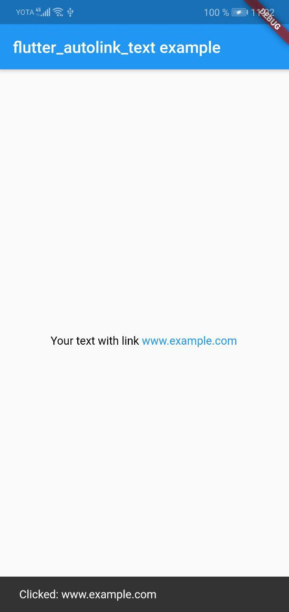

# flutter_autolink_text

[](https://pub.dev/packages/flutter_autolink_text)

## About
Text widget, that turns URLs, email and phone numbers into clickable inline links in text for flutter

## Install

Install by adding this package to your `pubspec.yaml`:
```yaml
dependencies:
  flutter_autolink_text: ^1.0.0+1
```

## Usage
### Basic:
```dart
import 'package:flutter_autolink_text/flutter_autolink_text.dart';

AutolinkText(
	text: 'Your text with link www.example.com',
	textStyle: TextStyle(color: Colors.black),
	linkStyle: TextStyle(color: Colors.blue),
	onWebLinkTap: (link) => print('Clicked: ${link}')
);
```

### Add more links:
To add autolink to emails and phone numbers:
```dart
import 'package:flutter_autolink_text/flutter_autolink_text.dart';

AutolinkText(
	text: ...,
	textStyle: TextStyle(color: Colors.black),
	linkStyle: TextStyle(color: Colors.blue),
	onWebLinkTap: (link) => print('Clicked: ${link}'),
	onEmailTap: (link) => print('Clicked: ${link}'),
	onPhoneTap: (link) => print('Clicked: ${link}')
);
```

If you're using [`url_launcher`](https://pub.dev/packages/url_launcher) to open your links in browser, you can add `mailto:` for emails and `tel:` for phone numbers to open them in other apps

### Humanizing:
Remove `http://` or `https://` from the start of the URL using `humanize`:
```dart
import 'package:flutter_autolink_text/flutter_autolink_text.dart';

AutolinkText(
	text: 'Link is https://example.com',
	humanize: true,
	...
);
```

